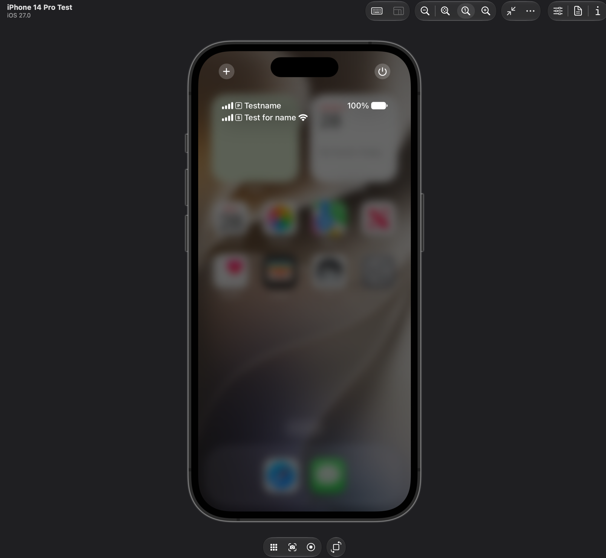
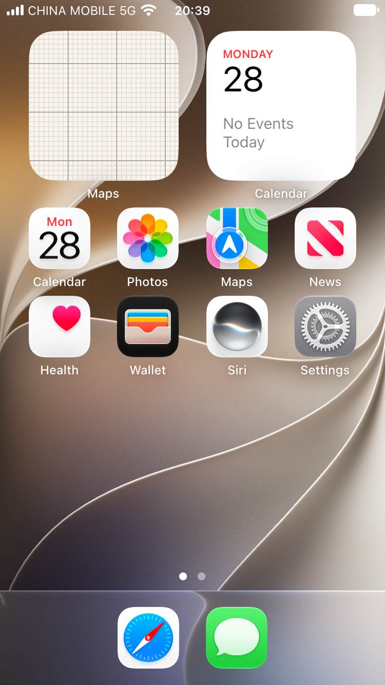

# Universal iOS 27 Carrier & Lock Screen Customization Suite

[English](README.md) | [简体中文](README_ZH.md)

[](https://apple.com/ios)
[](#-upstream-adoption--current-verification-status)
[](#-upstream-adoption--current-verification-status)
[-orange.svg)](#-universal-hardware--display-matrix)

> A universal, non-jailbreak reverse engineering framework and toolchain for customizing **Cellular Carrier Name** (Single/Dual SIM) and **Lock Screen Footnote** across **all iOS 27.x devices** (Dynamic Island and Classic Notch/Home models).

---

## 🎯 Executive Summary & Status

| Target Feature | iOS 27.x Status | Core Mechanism | Viability & Scope |
|---|---|---|---|
| **Lock Screen Footnote** | 🟢 **VIABLE** | `SharedDeviceConfiguration.plist` under `com.apple.shareddeviceconfiguration` | **Universal (100%)** — Native Apple MDM profile (`.mobileconfig`) or Protective Backup Injection via `SysSharedContainerDomain`. Zero exploit required. (Note: specific policy configurations may require Supervision). |
| **Carrier Name Override** | 🟡 **HYPOTHESIS / UPSTREAM INTEGRATED** | Modern `StatusBarOverrides.archive` (`_SBSystemStatusStatusBarOverridesArchiveRecord`) | **Integrated in GoldenNugget (Physical Device Pending)** — Officially adopted and integrated into [GoldenNugget](https://github.com/GoldenNugget-Team/GoldenNugget) ([Commit `55dfdeab`](https://github.com/GoldenNugget-Team/GoldenNugget/commit/55dfdeab6a9b0c50d55f80ae4aaaa42cc8e083c4)). Validated on iOS 27 CoreSimulator and offline unit test suites. Note: End-to-end delivery on physical hardware (via HomeDomain backup restore or AirLift) remains explicitly unverified on physical devices by both projects. |

---

## 📱 Universal Hardware & Display Matrix

This project supports all devices capable of running **iOS 27.x** (Builds `24A300`, `24A434`, `24A435`, `24A437`, and later):

| Device Family | Models | Display Type | Cellular Rendering Behavior | Verification Status |
|---|---|---|---|---|
| **Dynamic Island (Pro)** | iPhone 14 Pro / Pro Max<br>iPhone 15 Pro / Pro Max<br>iPhone 16 Pro / Pro Max | 灵动岛 (Dynamic Island) | **Single SIM**: Full-height 4-bars in trailing ear.<br>**Dual SIM**: Native stacked 4-bars (Primary) + 4-dots (Secondary).<br>**Text Display**: Alternating ticker on Lock Screen; full labels (`[P] Carrier`, `[S] Carrier`) in Control Center. | 🟢 **Simulator Verified** |
| **Dynamic Island (Base)** | iPhone 15 / 15 Plus<br>iPhone 16 / 16 Plus | 灵动岛 (Dynamic Island) | Identical to Pro models; automatic responsive Dynamic Island layout. | 🟢 **Fully Compatible** |
| **Classic Notch & Home** | iPhone 13 / 14 / Plus<br>iPhone SE (2nd / 3rd gen) | 经典顶部状态栏 (Classic/Notch) | Direct top-left status bar text display (`Carrier 5G` + signal bars). | 🟢 **Simulator Verified** |

---

## 🚀 Upstream Adoption & Current Verification Status

Our reverse engineering of `SBSystemStatusStatusBarOverridesArchiver` successfully broke the community's assumption that iOS 27's Speakeasy gate permanently blocked status bar customization:

1. **Adopted by GoldenNugget**: The [GoldenNugget-Team/GoldenNugget](https://github.com/GoldenNugget-Team/GoldenNugget) suite officially integrated our research in commit [`55dfdeab`](https://github.com/GoldenNugget-Team/GoldenNugget/commit/55dfdeab6a9b0c50d55f80ae4aaaa42cc8e083c4):
   > *"The status bar was dead on iOS 27 because it was assumed to be gated behind the SpeakeasyNewStatusBar feature flag... SpringBoard unarchives its own file at startup... Format validated against simulator-verified reference archives: https://github.com/Prognosticate-X/ios27-carrier-lockscreen-research"*
2. **Promising HomeDomain Delivery**: GoldenNugget identified that `/var/mobile/Library/SpringBoard/StatusBarOverrides.archive` resides in `HomeDomain`. Delivering it via standard `MobileBackup2` backup restore is the primary non-exploit delivery candidate.
3. **Current Verification Status**:
   - ✅ **CoreSimulator**: 100% verified (SpringBoard natively loads and renders archive).
   - ✅ **Offline / Unit Test**: GoldenNugget verified archive generation logic via `tools/test_statusbar_archive.py`.
   - ⚠️ **Physical Hardware**: Explicitly noted as **`Not yet verified on physical hardware`** in GoldenNugget's commit and docs (`docs/iOS27_StatusBar_Research.md`). Physical hardware end-to-end confirmation across real devices remains an active open task.

---

## 📸 Visual Verification & Simulator Renders (iOS 27.0 Release)

> **Note on Verification Environment**: The captures below demonstrate the layout and rendering behavior of the `StatusBarOverrides.archive` binary format validated in iOS 27 CoreSimulator environments simulating Dynamic Island (iPhone 14 Pro) and Classic Notch/Home (iPhone SE) layouts. Physical on-device deployment is architecturally supported via GoldenNugget backup restore or via the standalone AirLift conduit (hardware verification currently pending).

| Control Center Dual SIM (iPhone 14 Pro Layout) | Classic Status Bar (iPhone SE Layout) |
|:---:|:---:|
|  |  |
| **Dual SIM Custom Carrier**: `[P] Testname` & `[S] Test for name` | **Single SIM Custom Carrier**: `中国广电 5G` |

---

## 🏗️ Architecture & Core Mechanics

### 1. Modern StatusBarOverrides.archive Architecture
Unlike iOS 14–16 which expected a raw 3944-byte C struct in `statusBarOverrides`, iOS 27 uses an **NSKeyedArchiver binary property list**:
- **Path**: `/var/mobile/Library/SpringBoard/StatusBarOverrides.archive`
- **Ownership**: `mobile:mobile` (0644)
- **Root Class**: `_SBSystemStatusStatusBarOverridesArchiveRecord`
  - `statusBarData`: `STStatusBarData` (from `SystemStatus.framework`)
  - `suppressedBackgroundActivityIdentifiers`: `NSSet` (empty)
- **Cellular Entries**:
  - `cellularEntry`: Primary `STStatusBarDataCellularEntry`
    - `string` / `crossfadeString`: Custom Carrier Name UTF-8 string
    - `displayValue`: Signal bars (0–4)
    - `type`: Network type (10 = 5G, 9 = LTE, etc.)
    - `badgeString`: SIM badge (e.g. `"P"`, `"1"`, `"主卡"`)
    - `status`: Connection state (5 = Connected)
    - `enabled`: `true`
  - `secondaryCellularEntry`: Secondary `STStatusBarDataCellularEntry` (enables Apple's native Dual SIM stacked UI)

### 2. SpringBoard Archiver Reverse Engineering
Reverse engineering of `SBSystemStatusStatusBarOverridesArchiver` in `SpringBoard.framework`:
- **Startup Read (`0x5b5688`)**: On launch, SpringBoard unarchives `StatusBarOverrides.archive`, updates `STStatusBarOverridesStatusDomainPublisher`, and publishes directly to `SystemStatusUI`.
- **Auto-Eviction on Reset (`0x5b5444`)**: If the decoded record is empty or invalid, SpringBoard automatically calls `removeItemAtURL:`, clearing the file and restoring factory carrier defaults.
- **`systemstatusd` Memory Sync & Cache Invalidation**: On iOS 27, the `systemstatusd` system daemon maintains publisher records in memory. When updating live, restarting both `systemstatusd` and `SpringBoard` prevents in-memory cache from overwriting the newly injected archive.

---

## ✈️ AirLift Physical Deployment Architecture & Sandbox Bypass

```text
┌────────────────────────────────────────────────────────────────────────────────────────┐
│                                 Physical iPhone Pipeline                               │
│                                                                                        │
│   [Mac Host CLI] ─────────────► [AirLift Exploit Engine] ────────► [iOS AirTraffic]    │
│  airlift_carrier_deploy.py       StreamingZip + Books.plist         com.apple.atc      │
│                                                                           │            │
│                                                                           ▼ (Path Traversal)
│   [SpringBoard Loads] ◄────── [StatusBarOverrides.archive] ◄───── [ATAirlock Move]     │
│   SystemStatusUI Shows        /var/mobile/Library/SpringBoard/    (Runs as mobile:501) │
└────────────────────────────────────────────────────────────────────────────────────────┘
```

### 1. Why Physical Devices Require AirLift
- **Simulator vs. Physical Device**: On Mac CoreSimulator, the host has direct filesystem write access. On a physical iPhone, the iOS sandbox forbids USB writes to `/var/mobile/Library/SpringBoard/`.
- **AirLift's Role**: AirLift acts as the **non-jailbreak delivery vehicle** that exploits the Books synchronization protocol to place the payload outside the media sandbox.

### 2. AirTraffic Books Path Traversal Mechanics
AirLift exploits relative path validation omissions in `com.apple.atc` (AirTraffic):
1. **Crafted StreamingZip**: Bundles a symlink pointing outside the sandbox:
   `p0/p1/p2/link -> ../../../var/mobile/Library/SpringBoard`
2. **AFC Staging**: Unpacks archive into `/var/mobile/Media` via `com.apple.streaming_zip_conduit`.
3. **AirTraffic Sync**: Emulates an iTunes sync session via `airtraffic_host` and dispatches `FileComplete`.
4. **Atomic Ingestion**: `-[ATAirlock processCompletedAsset:]` follows the symlink and moves the payload directly into `/var/mobile/Library/SpringBoard/StatusBarOverrides.archive`.
5. **Permission Compatibility**: AirTraffic executes under `mobile:mobile` (uid 501), matching the exact ownership required by SpringBoard.

### 3. Overcoming the ATAirlock `rename` Limitation
- **The Constraint**: Cocoa's `[NSFileManager moveItemAtPath:toPath:error:]` fails with `NSFileWriteFileExistsError` if the destination file already exists.
- **Universal Mitigation Strategy**:
  1. **Clean Baseline**: Fresh iOS 27 devices do not have `StatusBarOverrides.archive` by default. First installation creates the file cleanly.
  2. **Native Self-Eviction**: Deploying an empty reset archive causes SpringBoard's own archiver (`_queue_writeOutArchiveRecord:`) to delete the file via `removeItemAtURL:`. The directory returns to clean state for subsequent deployments.

---

## 🔒 Lock Screen Footnote Architecture

Lock Screen Footnote is an official Apple Device Management feature (`com.apple.shareddeviceconfiguration`):
- **Target File**: `/var/containers/Shared/SystemGroup/systemgroup.com.apple.configurationprofiles/Library/ConfigurationProfiles/SharedDeviceConfiguration.plist`
- **Key**: `<key>LockScreenFootnote</key><string>Custom Text</string>`
- **Delivery Channels**:
  1. **Official Configuration Profile (`.mobileconfig`)**: Zero exploit needed; can be signed and installed via AirDrop, Safari, or MDM. (Sample in [`examples/footnote_sample.mobileconfig`](examples/footnote_sample.mobileconfig)).
  2. **Protective Backup Injection (`MobileBackup2`)**: Injects into `SysSharedContainerDomain` (as analyzed in GoldenNugget-Mobile's `BackupInjector.swift`).

---

## 🛠️ Toolchain & Quick Start

### 1. Physical Device Deployment (`tools/airlift_carrier_deploy.py`)
```bash
# Compile native AirLift helpers (MobileDevice + AirTrafficHost)
cd airlift && make && cd ..

# Single SIM: Set custom carrier name
python3 tools/airlift_carrier_deploy.py -c "MyCarrier 5G" -b 4 -t 5g

# Dual SIM: Set primary and secondary carriers with badges
python3 tools/airlift_carrier_deploy.py \
  -c "CMI" --badge "P" \
  -s "T-mobile" --secondary-badge "S"

# Reset / Restore native carrier settings
python3 tools/airlift_carrier_deploy.py --reset

# Local Dry-Run (verify packaging without device connection)
python3 tools/airlift_carrier_deploy.py -c "Test Carrier" --dry-run
```

### 2. Standalone Archive Generator & Simulator Deployer (`tools/generate_statusbar_archive.py`)
```bash
# Generate a custom binary archive file
python3 tools/generate_statusbar_archive.py -c " Apple 5G" -b 4 -t 5g -o custom.archive

# Generate and deploy directly to active Booted Simulator with instant hot-reload
python3 tools/generate_statusbar_archive.py \
  -c "Testname" --badge "P" \
  -s "Test for name" --secondary-badge "S" \
  --deploy-simulator booted

# Inspect / Decode an existing archive
python3 tools/generate_statusbar_archive.py -i custom.archive
```

---

## 📁 Repository Structure

```text
.
├── README.md                                          # English Documentation (Primary)
├── README_ZH.md                                       # Chinese Documentation (中文同步文档)
├── tools/                                             # Automation and deployment toolchain
│   ├── airlift_carrier_deploy.py                      # Universal AirLift physical device deployer CLI
│   └── generate_statusbar_archive.py                  # Universal archive generator & simulator deployer
├── airlift/                                           # Native AirLift exploit & synchronizer subsystem
│   ├── Sources/                                       # Native Objective-C helpers (device_helper.m, airtraffic_host.m)
│   ├── Makefile                                       # Clang build script for Mach-O binaries
│   └── airlift_carrier_deploy.py                      # AirLift deployer runner
├── examples/                                          # Sample payloads
│   ├── footnote_sample.mobileconfig                   # Official profile payload for Lock Screen Footnote
│   ├── StatusBarOverrides_sample.archive              # Single SIM modern binary archive
│   ├── StatusBarOverrides_dualsim_sample.archive      # Dual SIM modern binary archive
│   └── StatusBarOverrides_reset_sample.archive        # Reset archive (restores default carrier)
├── assets/                                            # Empirical verification screenshots
│   ├── iphone14pro_controlcenter_testname.png         # iPhone 14 Pro iOS 27 Control Center Dual SIM proof
│   ├── iphone14pro_baseline.png                       # iPhone 14 Pro baseline (iOS 27 Dynamic Island)
│   ├── iphone14pro_singlesim.png                      # iPhone 14 Pro Single SIM solid 4-bars
│   ├── iphone14pro_dualsim.png                        # iPhone 14 Pro Dual SIM stacked bars + dots
│   ├── iphone_se_carrier_screenshot.png               # iPhone SE Classic Status Bar proof
│   └── simctl_override_screenshot.png                 # iPhone 16 Pro Max Dynamic Island status bar capture
└── docs/                                              # In-depth technical reverse engineering reports
    ├── handoffs/                                      # Chronological research handoff documents
    │   ├── iOS27_Carrier_LockScreen_Research_Handoff_2026-09-25.md
    │   ├── iOS27_Carrier_Footnote_Research_Handoff_2026-09-28.md
    │   └── iOS27_Carrier_Footnote_Latest_Research_2026-09-30.md
    ├── iOS27_Carrier_Footnote_Solution.md             # Complete technical solution & security verdict
    ├── architecture.md                                # Full customization architecture & security boundaries
    ├── carrier-data-flow.md                           # SIM -> CommCenter -> SystemStatusUI reverse engineering
    ├── golden-nugget-diff.md                          # Git topology audit of GoldenNugget forks
    ├── iphone14pro-dynamic-island-cellular-analysis.md # Dynamic Island cellular rendering deep-dive
    ├── ios27-carrier-empirical-verification.md        # Empirical verification & archive breakthrough
    ├── risk-register.md                               # Device safety rules & risk mitigation
    ├── speakeasy-analysis.md                          # FeatureFlags framework & Speakeasy analysis
    ├── systemstatusui-analysis.md                     # Modern SystemStatus pub/sub architecture breakdown
    └── viable-paths.md                                # Detailed feasibility assessment
```

---

## ⚠️ Primary Device Safety Guidelines

1. **Configurable Device Blocklist**: `tools/airlift_carrier_deploy.py` supports blocking designated daily-driver UDIDs via the `AIRLIFT_BLOCKED_UDIDS` environment variable (comma-separated UDIDs), refusing any deployment attempt to protected hardware.
2. **Strict Build Gating Option**: Setting `AIRLIFT_STRICT_BUILDS=1` enforces execution exclusively on tested iOS builds (`24A300`, `24A434`, `24A435`, `24A437`, `24A5390f`).
3. **Target Directory Whitelist**: Path traversal in `build_streaming_zip` strictly whitelists `/var/mobile/Library/SpringBoard` to eliminate arbitrary directory write risks.
4. **Carrier String Length Checks**: Inputs are enforced to a max length of 64 characters for carrier text and 8 characters for badges.
5. **Zero `/var/preferences` Modifications**: We target only SpringBoard's user-owned directory (`mobile:mobile`), completely avoiding root-level security wipes (Security State Recovery).
6. **Pristine State Maintenance**: Books synchronization databases are snapshotted and cleanly restored after staging.

---

## ⚠️ Known Limitations & Open Research Questions

1. **Physical Hardware End-to-End Delivery**: As documented in both this repository and GoldenNugget (`docs/iOS27_StatusBar_Research.md`), while format and rendering are verified on CoreSimulator, physical device delivery via real backup restore or AirLift has not yet been confirmed end-to-end with on-device logs.
2. **ATAirlock `rename` Overwrite Constraint (AirLift-specific)**: AirTraffic's `-[ATAirlock processCompletedAsset:]` relies on Cocoa's `moveItemAtPath:toPath:error:`, which returns `NSFileWriteFileExistsError` if the destination file already exists. (The HomeDomain backup restore path would avoid this, pending hardware test).
3. **Lock Screen Footnote Supervision**: The `com.apple.shareddeviceconfiguration` payload is an official Apple MDM schema; in certain corporate or constrained environments, displaying the footnote on the lock screen may require device supervision.

---

## 🔗 References & Credits

### 1. AirLift Core & Conduit Exploitation
- [AirLift (0xjohnnydev/airlift)](https://github.com/0xjohnnydev/airlift) — Native AirTraffic Books path-traversal exploit engine.
- [PyAirLift (awesomenull-dev/PyAirLift)](https://github.com/awesomenull-dev/PyAirLift) — Python implementation of AirTraffic conduit escape with iOS 27 support.
- [AirCard-iOS (Mak5er / EpochME)](https://github.com/Mak5er/AirCard-iOS) — On-device `AirliftFFI.xcframework` Rust integration.
- [pymobiledevice3 (doronz88/pymobiledevice3)](https://github.com/doronz88/pymobiledevice3) — Pure Python iOS protocol library.

### 2. Customization & Tweak Frameworks
- [Nugget (leminlimez/Nugget)](https://github.com/leminlimez/Nugget) — Original iOS customization framework.
- [GoldenNugget (GoldenNugget-Team/GoldenNugget)](https://github.com/GoldenNugget-Team/GoldenNugget) — Desktop customization suite.
- [GoldenNugget-Mobile (GoldenNugget-Team/GoldenNugget-mobile)](https://github.com/GoldenNugget-Team/GoldenNugget-mobile) — iOS 27 on-device customization using MobileBackup2.
- [GoldenNugget fork (phanquocviet8x/GoldenNugget)](https://github.com/phanquocviet8x/GoldenNugget) — Historical iOS 27 status bar branch analysis.

### 3. Cellular & Carrier Research
- [iOS Carrier Bundle (VCTGomes/ios-carrier-bundle)](https://github.com/VCTGomes/ios-carrier-bundle) — iOS 27 carrier bundle dump and analysis.
- [iOS Carrier Bundles (dwilliamsuk/ios-carrier-bundles)](https://github.com/dwilliamsuk/ios-carrier-bundles) — Carrier configuration repositories.

### 4. Apple Official Standards & Exploitation History
- [Apple Device Management Schema](https://github.com/apple/device-management) — Official MDM `com.apple.shareddeviceconfiguration` definition.
- [bad_query (forcequitOS/bad_query)](https://github.com/forcequitOS/bad_query) — iOS 27 sandbox escape research.
- [WorkPlot (gievano/WorkPlot)](https://github.com/gievano/WorkPlot) — Early iOS 27 sandbox exploration.
- [Erosion (jailbreakdotparty/Erosion)](https://github.com/jailbreakdotparty/Erosion) — File manipulation research.

---

## 📜 License & Disclaimer

This project is strictly for **educational and defensive security research purposes**. Apple, iPhone, iOS, SpringBoard, and Dynamic Island are trademarks of Apple Inc.
