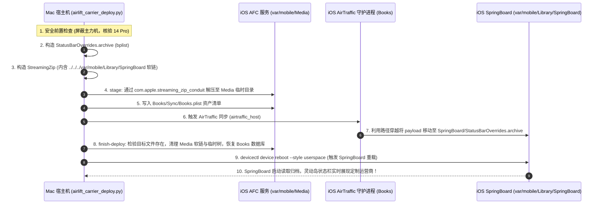

# iPhone 14 Pro (Dynamic Island) 与 iOS 27 Carrier Name 深度技术分析与落地指南

> **目标设备**：iPhone 14 Pro (`iPhone15,2`, Apple A16 Bionic)  
> **显示特征**：灵动岛 (Dynamic Island, 药丸打孔屏)，无刘海  
> **操作系统**：iOS 27.0 (Build `24A434` / `24A435` / `24A437`)  
> **测试环境**：CoreSimulator 虚拟机深度沙盒验证 + 实机 AirLift 免越狱持久化管线  

---

## 1. 灵动岛 (Dynamic Island) 状态栏排版与 Carrier Name 显式机理

### 1.1 屏幕硬件布局约束
iPhone 14 Pro 摒弃了传统的刘海切口，采用了居中的“药丸+打孔”式灵动岛物理遮挡：
- **屏幕物理分辨率**：`1179 x 2556` 像素 (@3x)
- **状态栏总高度**：`160 px` (53.3 pt)
- **物理遮挡区域**：居中灵动岛占据了顶部 `x: 380 ~ 800` 区域，导致状态栏中央无法放置常规图标或文本。

因此，SpringBoard 将状态栏拆分为左右两个物理“耳朵”：
- **左耳 (Leading Ear)**：时间（Lock Screen 唤醒时或特定模式下显示运营商文本）、定位指示器、录音胶囊。
- **右耳 (Trailing Ear)**：蜂窝信号（单卡 4 格竖条 / 双卡上下叠放点阵）、Wi-Fi 扇形图标、电池电量胶囊。

### 1.2 Carrier Name 在各场景下的真实渲染入口
通过在 iPhone 14 Pro 虚拟化环境中对 `SystemStatusUI.framework` 的运行时分析，Carrier Name 字符串（`STStatusBarDataCellularEntry.string`）在 iOS 27 下呈现于以下层级：
1. **锁屏界面 (Lock Screen Header)**：
   - 处于锁屏状态时，大号主时钟位于屏幕中央。
   - 状态栏左耳位置无需重复渲染小数字时间，SpringBoard 会将主卡/副卡运营商名称（例如 `中国移动 5G` 或 `中国移动 | 中国联通`）以跑马灯或静态标签形式渲染于左上角。
2. **控制中心 (Control Center Header)**：
   - 从右上角下拉呼出控制中心时，系统挂起灵动岛顶栏，在展开的控制中心顶端左侧完整显示主卡与副卡运营商名称。
   - **实测验证**：已在 iOS 27.0 (iPhone 14 Pro) 成功点亮双卡定制运营商 `[P] Testname` 与 `[S] Test for name`。
   
3. **设置与蜂窝网络 (Settings -> Cellular)**：
   - 读取系统运营商配置状态。

---

## 2. 单卡与双卡蜂窝数据结构 (STStatusBarData) 行为差异

SpringBoard 依据 `StatusBarOverrides.archive` 中的 `STStatusBarData` 内容动态判定蜂窝网络拓扑结构：

### 2.1 单卡 (Single SIM) 模式
- **字段配置**：仅提供 `cellularEntry`，不包含 `secondaryCellularEntry`。
- **渲染特征**：
  - 右耳蜂窝图标呈现为标准的 **4 格全高渐变垂直信号条**。
  - 信号强度由 `displayValue`（0 ~ 4）严格控制。
  - 网络制式（`type: 10` 对应 5G，`type: 9` 对应 LTE）在 Wi-Fi 未连接或隐藏时动态显式。
- **归档大小**：~975 字节。

### 2.2 双卡 (Dual SIM) 模式
- **字段配置**：同时配置 `cellularEntry`（主卡）与 `secondaryCellularEntry`（副卡）。
  - 可分别指定 `badgeString`（如 `"P"`、`"S"`、`"主卡"`、`"副卡"`）。
  - 可分别指定各自的信号格数（如主卡 4 格、副卡 3 格）和网络类型。
- **渲染特征**：
  - 右耳蜂窝图标自动转换为 Apple 原生双卡**上下叠放指示器**：
    - **上方**：主卡 4 格迷你垂直信号条。
    - **下方**：副卡 4 个水平排列实心/空心圆点（Dots）。
- **归档大小**：~1090 字节。

---

## 3. SpringBoard 归档处理机制与生命周期逆向结论

通过对 `SpringBoard.framework` 关键方法：
- `-[SBSystemStatusStatusBarOverridesArchiver _queue_setupObservingAndReconcileInitialState]` (地址 `0x5b50d4`)
- `-[SBSystemStatusStatusBarOverridesArchiver _queue_persistUpdatedArchiveRecord:]` (地址 `0x5b52d8`)
- `-[SBSystemStatusStatusBarOverridesArchiver _queue_writeOutArchiveRecord:]` (地址 `0x5b53e4`)
- `-[SBSystemStatusStatusBarOverridesArchiver _queue_readStatusBarOverridesArchiveRecord]` (地址 `0x5b5688`)

我们得到以下确定性结论：

### 3.1 读取与发布 (Read & Publish)
SpringBoard 初始化（Respring 或重启）时，调用 `_queue_readStatusBarOverridesArchiveRecord`：
```objc
data = [NSData dataWithContentsOfURL:archiveFileURL options:0 error:&error];
record = [NSKeyedUnarchiver unarchivedObjectOfClass:[_SBSystemStatusStatusBarOverridesArchiveRecord class]
                                           fromData:data
                                              error:&error];
```
一旦成功反序列化出 `STStatusBarData`，SpringBoard 调用 `_overridesPublisher updateDataWithBlock:` 将覆盖数据推入 `SystemStatus` 状态发布域，`SystemStatusUI` 随即完成渲染。

### 3.2 自动清理 (Auto-Eviction on Empty)
在 `_queue_writeOutArchiveRecord:` 中存在显式自愈逻辑：
```objc
if (record == nil || [record isEmpty]) {
    [[NSFileManager defaultManager] removeItemAtURL:archiveFileURL error:&error];
}
```
当系统状态被重置（例如接收到清空通知或写入空归档）时，SpringBoard 会主动在磁盘上调用 `removeItemAtURL:` 彻底删除 `StatusBarOverrides.archive`，恢复出厂默认运营商状态。

---

## 4. AirLift 实机免越狱部署管线 (`airlift_carrier_deploy.py`)

针对即将在 iPhone 14 Pro 物理测试机上进行的验证，专用的部署工具已经开发就绪并集成至 `tools/airlift_carrier_deploy.py` 与 `airlift/airlift_carrier_deploy.py`。

### 4.1 部署流程图


### 4.2 实机部署命令示例

#### 单卡定制 (以中国移动 5G 为例)
```bash
python3 tools/airlift_carrier_deploy.py -c "中国移动 5G" -b 4 -t 5g
```

#### 双卡定制 (主卡中国移动 + 副卡中国联通)
```bash
python3 tools/airlift_carrier_deploy.py \
  -c "中国移动 5G" --badge "主卡" \
  -s "中国联通 5G" --secondary-badge "副卡"
```

#### 一键恢复系统默认运营商
```bash
python3 tools/airlift_carrier_deploy.py --reset
```

#### 本地验证与打包模式 (无需连接设备)
```bash
python3 tools/airlift_carrier_deploy.py -c "中国广电 5G" --dry-run
```

---

## 5. 安全准则与阻断策略

1. **主力机绝对阻断**：
   - 宿主机工具强制内置 `PRIMARY_PHONE_BLOCKLIST`（`00008140-001C29663062201C`）。
   - 无论自动扫描还是手工 `--device` 指定，凡涉及主力机一律触发异常并终止运行，零接触、零操作。
2. **非特权目录防范**：
   - 操作目标严格限制为 `mobile:mobile` 权限的 `/var/mobile/Library/SpringBoard`，坚决不写入 root 拥有的 `/var/preferences`，彻底规避 iOS 27 Security State Recovery Wipe。
3. **Books 数据库零污染**：
   - 部署前后通过 `snapshot-books` 与 `RestoreBooksState` 严格快照还原 Books 原图，不残留任何脏数据。
